# Packet Trace System

익명 네트워크 환경에서 추적 대상을 자동으로 탐지·수집·분석하는 Python 기반 멀티 에이전트 시스템입니다.

> **개발 기간**: 2025.06 – 2025.12  
> **역할**: 패킷 수집 엔진 단독 설계 및 구현, Kafka 클러스터 구성, 인프라 자동화  
> **기술 스택**: Python 3.12, Scapy, Apache Kafka, Selenium, Flask

---

## 프로젝트 배경

익명 네트워크 상의 서버를 추적하기 위해서는 단순한 URL 접속 확인을 넘어 세 가지 데이터가 동시에 필요했습니다.

1. **서버 활성 여부**: HTTP/TCP 프로빙으로 대상 서버가 살아있는지 확인
2. **화면 증거 수집**: 접속 시점의 스크린샷을 자동 캡처하여 보관
3. **패킷 수준 이력**: 추적 요청 전후의 네트워크 패킷을 실시간 수집하여 저장

이를 위해 역할을 분리한 세 개의 독립 에이전트를 설계하고, Apache Kafka를 중심으로 수집 데이터를 중앙에 집계하는 구조를 구축했습니다.

---

## 시스템 개요



세 에이전트는 독립적으로 동작하며 Kafka 토픽을 통해 수집 데이터를 분리·전달합니다.

```
외부 API (추적 명령)
       │
       ▼
     Bot ──────────────────────────────────────────────────────────┐
       │                                                            │
       ├── 서버 상태 확인 ────────► Kafka: SRVR_STTS_CHG_HST       │
       ├── 스크린샷 캡처 ─────────► REST API (이미지 저장)          │
       └── 추적 패턴 실행 ─────────► Kafka: TRCE_FLFMT_HST         │
                  │ (동시 수집)                                      │
                  ▼                                                  │
            Sensor-Bot ──────────► Kafka: DMND_BOT_PCKT_HST        │
                                                                    │
DWI Sensor (상시 동작) ──────────► Kafka: TOR_NETWK_PCKT_HST      │
                                                                    │
                        중앙 수집 DB ◄──────────────────────────────┘
```

---

## 핵심 구현

### 무손실 패킷 수집 (3중 보호)

고트래픽 환경에서 단 하나의 패킷도 유실되지 않도록 3단계 보호 구조를 설계했습니다.

```
패킷 수신
    │
    ▼
1차: Queue(maxsize=20,000)  ← 인메모리 버퍼
    │ 오버플로우
    ▼
2차: overflow_*.json        ← 큐 초과 시 파일 덤프
    │
    ▼
3차: Kafka 배치 전송 (5초 주기, 3회 재시도)
    │ 전송 실패
    ▼
    producer_send_err_bk_*.json + 60초 주기 자동 재전송
```

10,000건/5초 극한 부하 환경에서 tcpdump 대비 **수집 일치율 100%** 를 검증했습니다.

### 멀티스레딩 아키텍처

메인 스레드가 패킷 스니핑을 블로킹으로 처리하는 동안, 3개의 데몬 스레드가 병렬로 동작합니다.

```python
# 메인 스레드: scapy 패킷 스니핑 (블로킹)
sniff(iface=IFACE, filter=bpf_filter, prn=packet_handler, store=0)

# 스레드 1: 5초 배치 전송
Thread(target=kafka_batch_sender, daemon=True).start()

# 스레드 2: 30초 GC (장기 운영 메모리 안정성)
Thread(target=run_gc_worker, daemon=True).start()

# 스레드 3: 60초 백업 복구 재전송
Thread(target=backup_file_sender, daemon=True).start()
```

### Bot 병렬 처리

서버 상태 확인 완료 후, 스크린샷 캡처와 추적 패턴 실행을 `ThreadPoolExecutor`로 동시에 처리합니다.

```python
with ThreadPoolExecutor(max_workers=2) as executor:
    future_screenshot = executor.submit(capture_screenshot, job)
    future_trace = executor.submit(run_trace_pattern, job)
```

단계 의존성(상태 확인 → 병렬 실행)을 보장하면서 전체 처리 시간을 단축했습니다.

### Kafka KRaft 클러스터 도입

ZooKeeper 의존성을 제거하고 KRaft 모드 3-브로커 클러스터를 직접 구성했습니다. 토픽별 부하를 측정하여 파티션 수를 최적화했습니다.

| Kafka 토픽 | 에이전트 | 수집 내용 |
|-----------|---------|---------|
| `TRCE_FLFMT_HST` | Bot | 추적 패턴 이행 결과 |
| `SRVR_STTS_CHG_HST` | Bot | 대상 서버 상태 변경 이력 |
| `TOR_NETWK_PCKT_HST` | DWI Sensor | 익명 네트워크 배경 트래픽 |
| `DMND_BOT_PCKT_HST` | Sensor-Bot | 추적 요청 연동 패킷 |

### 익명 네트워크 릴레이 노드 판별 API

특정 IP가 익명 네트워크의 릴레이 노드인지 실시간으로 확인하는 Flask REST API를 구현했습니다.

```
POST /api/v1/check-relay
{"ip": "1.2.3.4"}

→ {"is_relay": true}
```

컨트롤 포트에서 네트워크 상태 및 서버 디스크립터를 직접 조회하여 IPv4/IPv6 모두 매칭합니다.

---

## 프로젝트 구조

```
packet-trace-system/
├── bot/src/
│   ├── api_trce_trgt_receiver.py   # 추적 대상 목록 API 수신
│   ├── status_checker.py           # HTTP/TCP 프로빙 기반 서버 상태 판별
│   ├── screenshot_capture.py       # Selenium WebDriver 스크린샷 캡처
│   ├── trace_start.py              # 패킷 패턴 추적 실행
│   ├── api_screenshot_sender.py    # 스크린샷 multipart 업로드
│   ├── kafka_flfmt_sender.py       # 추적 이행 결과 Kafka 전송
│   ├── kafka_status_sender.py      # 서버 상태 변경 이력 Kafka 전송
│   ├── api_relay_checker.py        # 릴레이 노드 판별 로직
│   ├── api_relay_server.py         # 릴레이 확인용 Flask REST API
│   └── common_state.py             # Kafka Producer 전역 상태 관리
│
├── dwi_sensor/src/
│   ├── sniffer_producer.py         # 패킷 캡처, 큐 관리, Kafka 배치 전송
│   ├── backup_manager.py           # 오버플로우 덤프, 실패 백업, 자동 재전송
│   ├── gc_worker.py                # 주기적 가비지 컬렉션
│   ├── ip_utils.py                 # 수집기 IP 조회
│   └── common_state.py             # Kafka Producer 전역 상태 관리
│
└── sensor-bot/src/
    ├── sniffer_producer.py         # (dwi_sensor와 동일 엔진, 토픽만 분리)
    ├── backup_manager.py
    ├── gc_worker.py
    ├── ip_utils.py
    └── common_state.py
```

---

## 패킷 데이터 구조

수집된 패킷은 5초 배치로 묶어 아래 형식으로 Kafka에 전송됩니다.

```json
{
  "collector_ip": "수집기 IP",
  "timestamp": "2025-10-15 11:32:50.123456",
  "data": [
    {
      "ipAddr": "수집기 IP",
      "dpplIpAddr": "발신 IP",
      "dpplPortNo": 54321,
      "destIpAddr": "목적지 IP",
      "destPortNo": 443,
      "clctDt": "2025-10-15 11:32:45.123456",
      "pcktSize": 1024
    }
  ]
}
```

---

## 기술적 의사결정

**왜 Scapy인가?**  
tcpdump는 커맨드라인 도구로 Python 코드에서 파싱이 번거롭고, 수집 데이터를 즉시 가공하기 어렵습니다. Scapy는 레이어별 파싱, BPF 필터, 콜백 기반 처리를 Python 코드 안에서 직접 제어할 수 있어 큐 연동과 데이터 변환이 자연스럽게 통합됩니다.

**왜 Kafka인가?**  
3개 에이전트가 생산하는 데이터를 단일 REST API로 수집하면 병목과 유실 위험이 높습니다. Kafka는 토픽 단위로 데이터를 분리하고 소비자가 독립적으로 처리할 수 있어, 에이전트 장애가 수집 파이프라인 전체에 영향을 주지 않습니다.

**왜 인메모리 큐 + 파일 백업 이중 구조인가?**  
Kafka 연결 장애는 예측 불가능하게 발생합니다. 전송 실패 시 데이터를 버리는 대신 로컬 JSON으로 보관하고 연결 복구 후 자동 재전송하면, 수집기 자체가 일시적 버퍼 역할을 합니다. 이 구조로 Kafka 클러스터 재시작 중에도 패킷 데이터 유실이 발생하지 않았습니다.

---

## Tech Stack

| 분류 | 기술 |
|------|------|
| Language | Python 3.12 |
| Packet Capture | Scapy 2.5.0 |
| Message Queue | Apache Kafka (KRaft, kafka-python 2.2.15) |
| Browser Automation | Selenium 4.15.2 + ChromeDriver |
| Relay Detection | stem 1.8.1 |
| API Server | Flask 3.0.0 |
| Process Management | psutil 5.9.6 |
| Build | PyInstaller |
